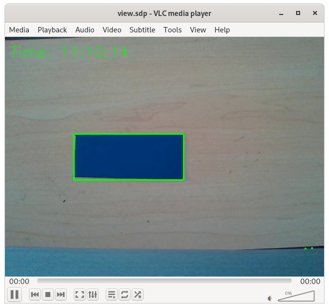

# RTP Stream Demo
A RTP streaming Demo that overlays the current time and a bounding box around a blue item on a camera feed.
This is done using GStreamer and OpenCV. The stream is viewed in VLC.



## Quickstart
Run setup in the root directory:
````
./setup.sh
````
This will install necessary packages.

Start the capture program:
````
python3 capture.py
````

In another terminal session, connect to the stream using VLC:
````
vlc view.sdp
````